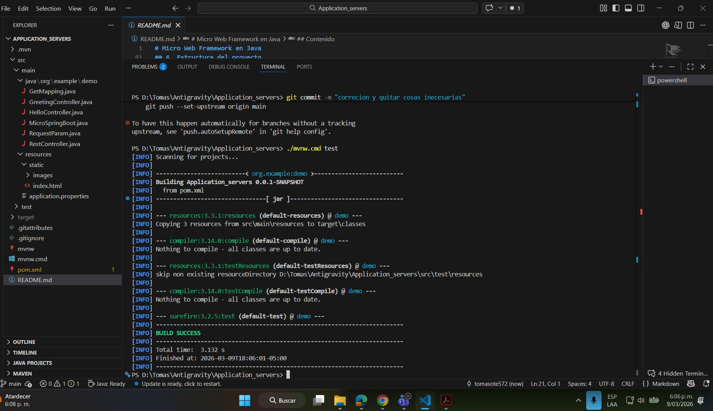
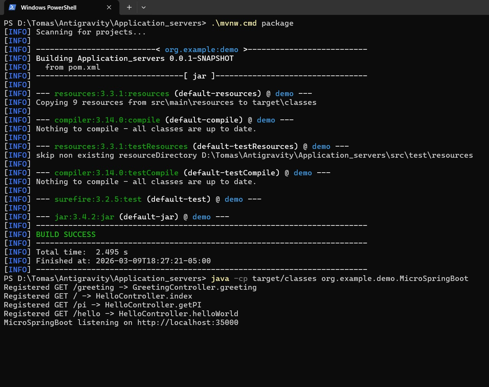
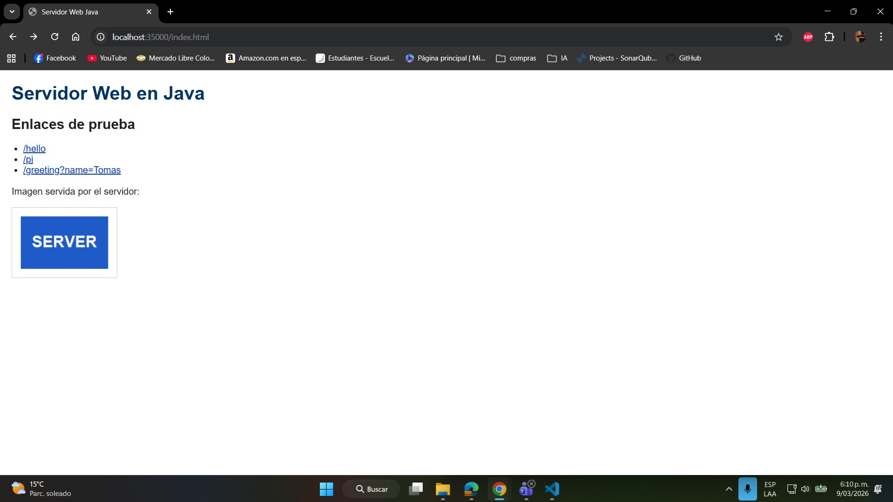
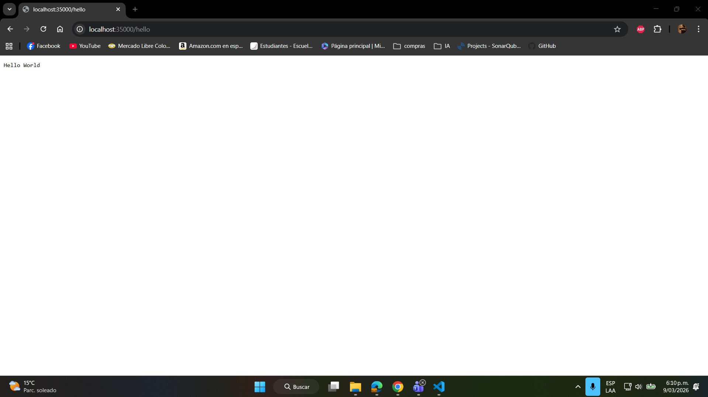
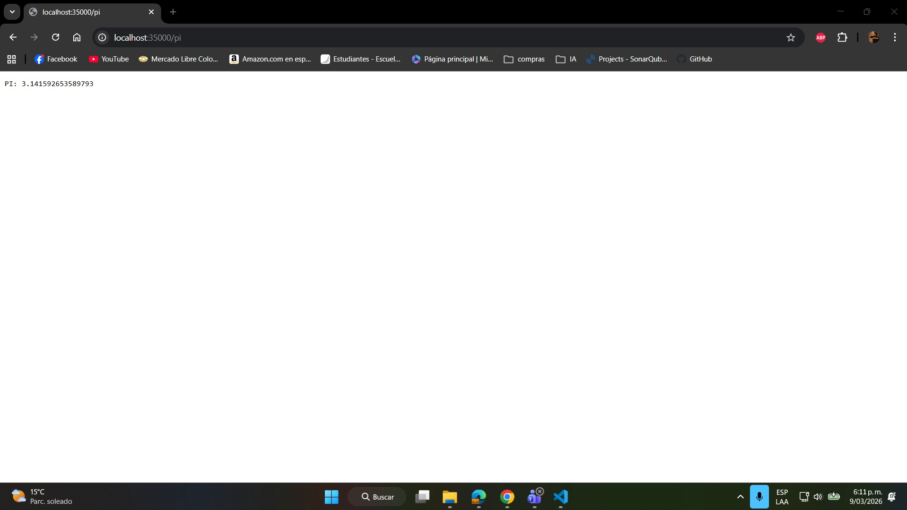
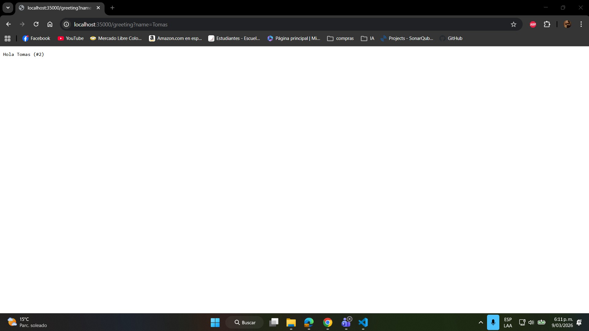

# Micro Web Framework en Java

### autor : tomas felipe ramirez alvarez

---

Proyecto desarrollado para el taller de servidores de aplicaciones en TDSE. La solución implementa un micro framework web sin dependencias externas para HTTP, construido con sockets, reflexión y anotaciones propias en Java.

El objetivo del proyecto es demostrar cómo construir una versión mínima de un servidor tipo Apache y, sobre ese servidor, un framework IoC capaz de publicar servicios web definidos a partir de POJOs.

## Contenido

1. Descripción general
2. Objetivos cubiertos
3. Arquitectura de la solución
4. Estructura del proyecto
5. Requisitos y compilación
6. Ejecución del servidor
7. Uso del framework
8. Aplicación de ejemplo
9. Validación funcional
10. Evidencia para la entrega

## 1. Descripción general

Este proyecto implementa un servidor HTTP mínimo que:

- Escucha conexiones TCP en un puerto configurable.
- Interpreta solicitudes HTTP `GET`.
- Entrega respuestas dinámicas a partir de controladores Java anotados.
- Sirve archivos estáticos desde el classpath.
- Soporta contenido HTML y PNG.
- Resuelve parámetros de consulta mediante anotaciones.

La aplicación fue diseñada como una base simple, entendible y académica, enfocada en mostrar el uso de reflexión en Java para descubrir componentes, inspeccionar métodos e invocarlos dinámicamente.

## 2. Objetivos cubiertos

Con esta implementación se cumplen los requisitos técnicos principales del taller:

- Servidor web propio en Java.
- Soporte de páginas HTML.
- Soporte de imágenes PNG.
- Framework IoC mínimo para construir aplicaciones web a partir de POJOs.
- Uso de anotaciones `@RestController`, `@GetMapping` y `@RequestParam`.
- Carga explícita de beans por línea de comandos.
- Descubrimiento automático de componentes al explorar el classpath.
- Aplicación web de ejemplo desplegable sobre el framework.
- Atención de múltiples solicitudes de forma no concurrente.
- Estructura y ciclo de vida manejados con Maven.

## 3. Arquitectura de la solución

La clase principal del framework es `MicroSpringBoot`. Allí se concentran las responsabilidades esenciales del servidor y del despachador de rutas.

### Componentes principales

| Componente | Responsabilidad |
| --- | --- |
| `MicroSpringBoot` | Inicia el servidor, descubre controladores, registra rutas, procesa solicitudes HTTP y sirve archivos estáticos. |
| `RestController` | Marca una clase como componente web administrado por el framework. |
| `GetMapping` | Declara la URI asociada a un método HTTP GET. |
| `RequestParam` | Enlaza parámetros del query string con argumentos del método del controlador. |
| `HelloController` | Controlador de ejemplo con endpoints básicos y una respuesta HTML simple. |
| `GreetingController` | Controlador que demuestra el uso de `@RequestParam` y el manejo de estado con `AtomicLong`. |

### Flujo de atención de una solicitud

1. El servidor abre un `ServerSocket` en el puerto configurado.
2. Se acepta una conexión entrante.
3. Se lee la primera línea HTTP y se extraen método, ruta y query string.
4. Si la ruta corresponde a un `@GetMapping`, el framework invoca el método del POJO por reflexión.
5. Si la ruta no es dinámica, se intenta localizar un recurso estático dentro de `src/main/resources/static`.
6. Se escribe la respuesta HTTP con `Content-Type`, `Content-Length` y el cuerpo correspondiente.
7. La conexión se cierra y el servidor espera la siguiente solicitud.

### Idea de diseño

La implementación evita librerías externas de servidor web. Todo el manejo HTTP se realiza con clases estándar de Java, lo que permite ver con claridad cómo se construye un framework web desde cero.

## 4. Estructura del proyecto

```text
Application_servers/
├── pom.xml
├── mvnw
├── mvnw.cmd
├── README.md
└── src/
	├── main/
	│   ├── java/
	│   │   └── org/example/demo/
	│   │       ├── MicroSpringBoot.java
	│   │       ├── RestController.java
	│   │       ├── GetMapping.java
	│   │       ├── RequestParam.java
	│   │       ├── HelloController.java
	│   │       └── GreetingController.java
	│   └── resources/
	│       ├── application.properties
	│       └── static/
	│           ├── index.html
	│           └── images/
	│               └── server.png
```

## 5. Requisitos y compilación

### Requisitos

- Java 21 o superior.
- Maven Wrapper incluido en el proyecto.

### Compilar

Desde la raíz del proyecto en PowerShell:

```powershell
\.\mvnw.cmd package
```

## 6. Ejecución del servidor

### Ejecución normal con descubrimiento automático

```powershell
java -cp target/classes org.example.demo.MicroSpringBoot
```

El servidor inicia en el puerto `35000` y deja disponible la aplicación en:

```text
http://localhost:35000/index.html
```

### Ejecución con carga explícita de controladores

Esta modalidad cumple la sugerencia de una primera versión donde los POJOs se pasan por línea de comandos:

```powershell
java -cp target/classes org.example.demo.MicroSpringBoot org.example.demo.HelloController org.example.demo.GreetingController
```

### Puerto configurable

El puerto por defecto está definido en `src/main/resources/application.properties`.

También se puede modificar desde consola:

```powershell
java -cp target/classes org.example.demo.MicroSpringBoot --port=8080
```

## 7. Uso del framework

El framework expone un modelo basado en anotaciones simples.

### `@RestController`

Indica que una clase debe ser detectada por el framework como componente web.

```java
@RestController
public class HelloController {
}
```

### `@GetMapping`

Publica un método sobre una URI HTTP GET. El método debe retornar `String`.

```java
@GetMapping("/hello")
public String helloWorld() {
	return "Hello World";
}
```

### `@RequestParam`

Obtiene un parámetro de la URL. Puede tener valor por defecto.

```java
@GetMapping("/greeting")
public String greeting(@RequestParam(value = "name", defaultValue = "World") String name) {
	return "Hola " + name;
}
```

### Qué hace internamente el framework

- Inspecciona el directorio de clases compiladas.
- Identifica clases anotadas con `@RestController`.
- Instancia cada controlador con su constructor vacío.
- Examina métodos anotados con `@GetMapping`.
- Registra cada ruta en un mapa interno.
- Al llegar una solicitud, invoca por reflexión el método correspondiente.
- Si el método tiene parámetros, los resuelve desde el query string usando `@RequestParam`.

## 8. Aplicación de ejemplo

La aplicación de ejemplo incluye rutas dinámicas y recursos estáticos.

### Endpoints dinámicos

| Endpoint | Descripción | Ejemplo de respuesta |
| --- | --- | --- |
| `GET /` | Página HTML generada por controlador | Documento HTML simple |
| `GET /hello` | Saludo de prueba | `Hello World` |
| `GET /pi` | Valor de PI | `PI: 3.141592653589793` |
| `GET /greeting` | Saludo con valor por defecto | `Hola World (#1)` |
| `GET /greeting?name=Tomas` | Saludo con parámetro | `Hola Tomas (#2)` |

### Recursos estáticos

| Recurso | Tipo |
| --- | --- |
| `GET /index.html` | `text/html` |
| `GET /images/server.png` | `image/png` |

### Enlaces útiles para probar en navegador

- `http://localhost:35000/`
- `http://localhost:35000/index.html`
- `http://localhost:35000/hello`
- `http://localhost:35000/pi`
- `http://localhost:35000/greeting`
- `http://localhost:35000/greeting?name=Pedro`
- `http://localhost:35000/images/server.png`

## 9. Validación funcional

Se verificó localmente que:

- `GET /greeting?name=Tomas` responde correctamente usando `@RequestParam`.
- `GET /index.html` retorna `Content-Type: text/html; charset=UTF-8`.
- `GET /images/server.png` retorna `Content-Type: image/png`.

Ejemplos en PowerShell:

```powershell
Invoke-WebRequest -UseBasicParsing http://localhost:35000/hello | Select-Object -ExpandProperty Content
Invoke-WebRequest -UseBasicParsing "http://localhost:35000/greeting?name=Tomas" | Select-Object -ExpandProperty Content
(Invoke-WebRequest -UseBasicParsing http://localhost:35000/index.html).Headers['Content-Type']
(Invoke-WebRequest -UseBasicParsing http://localhost:35000/images/server.png).Headers['Content-Type']
```

## 10. Evidencia para la entrega

- Captura de la compilación exitosa con `./mvnw.cmd package`.
    -  
      
- Captura de la consola mostrando el arranque del servidor.
    - 
- Captura del navegador abriendo `http://localhost:35000/index.html`.
    - 
- Captura de la URL `http://localhost:35000/greeting?name=TuNombre`.
    - 
    - 
    -  
- Evidencia del despliegue en AWS y acceso correcto a la aplicación.

